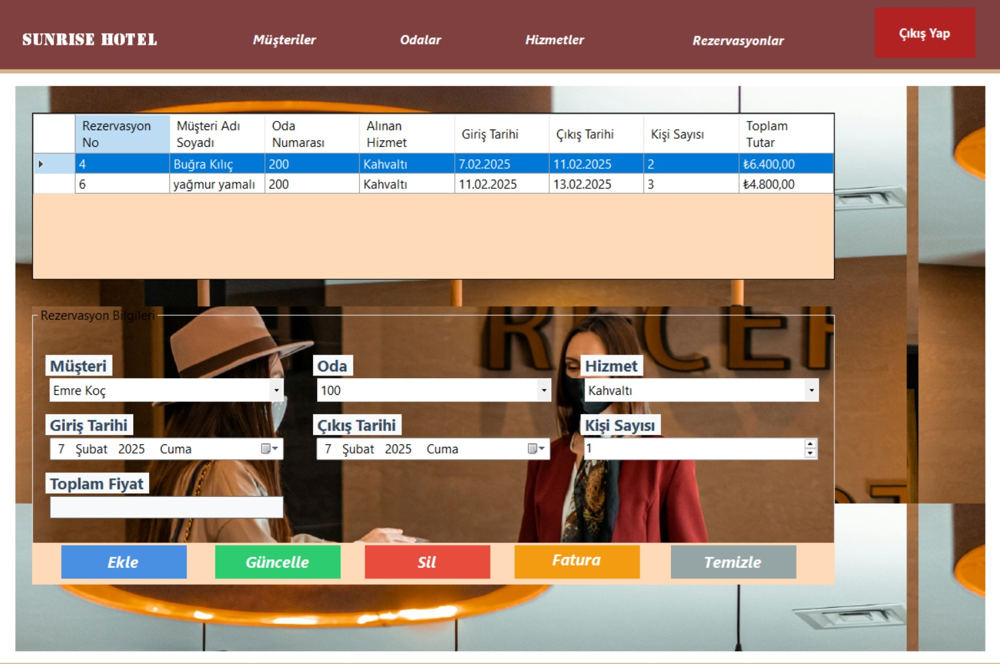

# SunriseHotel Projesi

Bu proje, bir otel yönetim sistemini içeren C# Windows uygulamasıdır. Aşağıda sistemin çeşitli diyagramları ve ekran görüntüleri bulunmaktadır.

## 📌 Use Case Diyagramı  

## 📌 UML Diyagramı  

## 📌 Rezervasyonlar Sayfası  

## 📌 Odalar Sayfası  

## 📌 Müşteriler Sayfası  

## 📌 Hizmetler Sayfası  

## 📌 Giriş Ekranı  

## 📌 Ana Sayfa  

